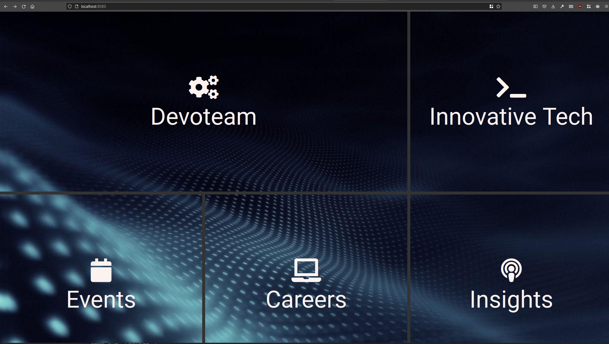

# Demo App
Spring Boot demo application which creates a landing page that redirects to various other pages.


# Pre-requisites
- JDK 1.8
- Maven

# Build
## Compile

```bash
mvn clean compile
```

## Run unit tests
```bash
mvn surefire-report:report

[INFO] 
[INFO] Results:
[INFO] 
[INFO] Tests run: 5, Failures: 0, Errors: 0, Skipped: 0
```

## Maven Build
```bash
mvn clean install spring-boot:repackage
```

Build a specific version
```bash   
mvn versions:set -DnewVersion=1.0.0
mvn clean install spring-boot:repackage
```

## Docker Build
After the maven build has been made, the application can be packaged into a docker image (set the tag to the maven version).
```bash
docker build -t ghcr.io/amreshh/demo-app:1.0.0 .
```

# Running the application
## Standalone jar
The application can be run as a standalone jar as follows (replace the version with the maven version).
```bash
java -jar ./target/demo-app-1.0.0.jar
```

## Docker
```bash
docker run -d -p 8080:8080 ghcr.io/amreshh/demo-app:1.0.0
```

# Application endpoints
- Main application: http://localhost:8080/
- Actuator endpoint: http://localhost:8080/actuator
- Health: http://localhost:8080/actuator/health

